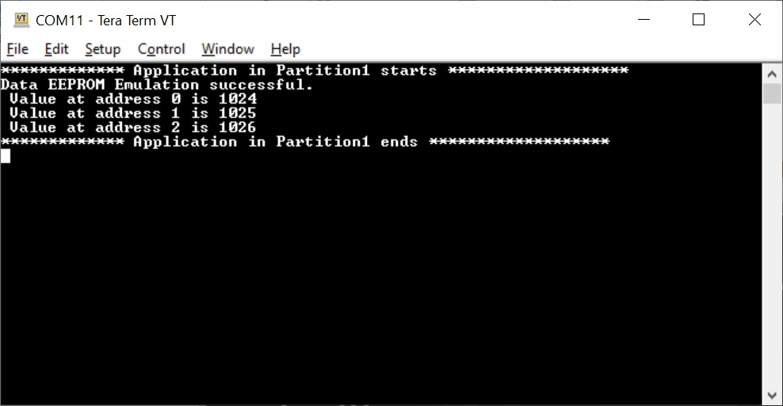

## dsPIC33CK Curiosity Data EEPROM Emulation Demo

## Summary

Microchip Technology Inc., has expanded its product portfolio to include a wide variety of cost-effective PIC® Microcontrollers (MCUs) without an internal data EEPROM.

Many applications store nonvolatile information in the Flash program memory using table read and write operations. Applications that need to frequently update these data may have greater endurance requirements
than the specified Flash endurance for the MCU/Digital Signal Controller (DSC) devices.

The alternate solution of using an external, serial EEPROM device may not be appropriate for cost-sensitive or pin-constrained applications.

This 16-Bit Data EEPROM Emulation library presents a third alternative that addresses these issues. This library features an interface similar to an internal data EEPROM, which
uses available program memory and can improve endurance by a factor as high as 500.

This code example demonstrates the usage of 16-Bit Data EEPROM Emulation Library.

## Related Documentation

- dsPIC33CK256MP508 microcontroller (https://www.microchip.com/dsPIC33CK256MP508)
- Emulating Data EEPROM for PIC18 and PIC24 MCUs and dsPIC33 DSCs (https://www.microchip.com/en-us/application-notes/an1095)

## Software Used

- MPLAB® X IDE v6.15 or newer (https://www.microchip.com/mplabx)
- MPLAB® XC16 v2.00 or newer (https://www.microchip.com/xc)
- Any of the serial terminal application. Example: Tera Term (https://ttssh2.osdn.jp/index.html.en)
- 16-bit Data EEPROM Emulation Library (DEE) for PIC24 MCUs and dsPIC33 DSCs (https://www.microchip.com/en-us/software-library/16-bit_data_eeprom_emulation)

## Hardware Used

- dsPIC33CK Curiosity Development Board (https://www.microchip.com/DM330030)
- Micro USB Cable

**Note:** The word panel and partition means the same thing and used interchangeably in this document.

## Operation
There are 2 examples in this repository. Example1 uses single panel and Example2 demonstrates dual panel capability of DEE.
Using dual panel is useful to not cause CPU execution stall during the normal runtime mode when the applications uses the DEE, which would be stored in the inactive partition.

## Example1:
This demo runs the Data EEPROM Emulation , if emulation is successful then prints a message to the serial terminal saying "Data EEPROM Emulation successful. Value at address 0 is 1024 and address1 is 1025"
If emulation fails it prints a message to the serial terminal saying "Data EEPROM Emulation failed".

## Example2:
There are 2 MPLABX projects under folder "dspic33ck-curiosity-dual-panel-dee-demo". One project for programming the first partition another for programming the second partition.

In a typical field scenario, boot-loader will help to do a live update i.e. boot-loader will help to download the new application to the secondary
partition and this new application will be configured such that on reboot, application in secondary partition will execute(secondary partition
becomes primary or active partition).

If we want to program both the partitions of the microcontroller, MPLABX provides an option to create an unified hex file for programming both program memory partitions with different applications. In order to do that users have to configure one MPLABX project with XC16(Global Options) ->Partition as "Partition One/Active" and another MPLABX project with XC16(Global Options) ->Partition as "Partition Two/Inactive". Then second MPLABX project needs to be linked to first MPLABX project as loadable as shown below.

The projects in this example are already linked so that when dee-dual-panel-demo-partition1.X is built and programmed, it programs both the partitions.

After programming, the application in the first partition(active partition) will execute and DEE library will use the inactive partition(second partition) to store the DEE data. User will see the following data on the serial terminal on successful emulation,

After some time, once the emulation is completed and output is displayed, user has to reset the board. The aplication in the first partition, configures the configuration bits BSEQ and IBSEQ in the second partition, such that on reset second partition becomes the active partition. On resetting the board
application in the second partition will execute(second partition will become the active partition). DEE Library will check if there is any data available in the active partition from the previous iteration, if so it copies the data to the inactive partition(first partition), delete the previous iteration data from the active partition and continue with the emulation.

The following data will be displayed on successful emulation.

## Important Note
If there is no requirement for partition switching, the entire second partition(inactive partition) can be used for storing the DEE data. If partition switching is required make sure that free space in executable partition(active partition) is larger than the required DEE data structure size.

## Accessing 16-Bit Data EEPROM Emulation Library

*Note:* More MCC Melody devices support will be added in future releases.

| Device Family         | Procedure                  |
| -----------           | -----------                |
| Devices supported on Melody| 1. Create project   2. Launch MCC   3. Select "MCC Melody"        4. "16-Bit Data EEPROM Emulation Library "will be available under "Libraries"              |
|   Devices not supported on Melody                   | 1. Make sure https://ww1.microchip.com/downloads/en/DeviceDoc/script-1.29.3.mc3lib is installed   2. Create project   3. Launch MCC   4. Select "Classic MCC"       5. Switch core version to "5.2.1"            6. "16-Bit Data EEPROM Emulation Library" will be available under "Libraries"              |

For more information refer: https://www.microchip.com/en-us/software-library/dspic33-pic24-data-eeprom-emulation
